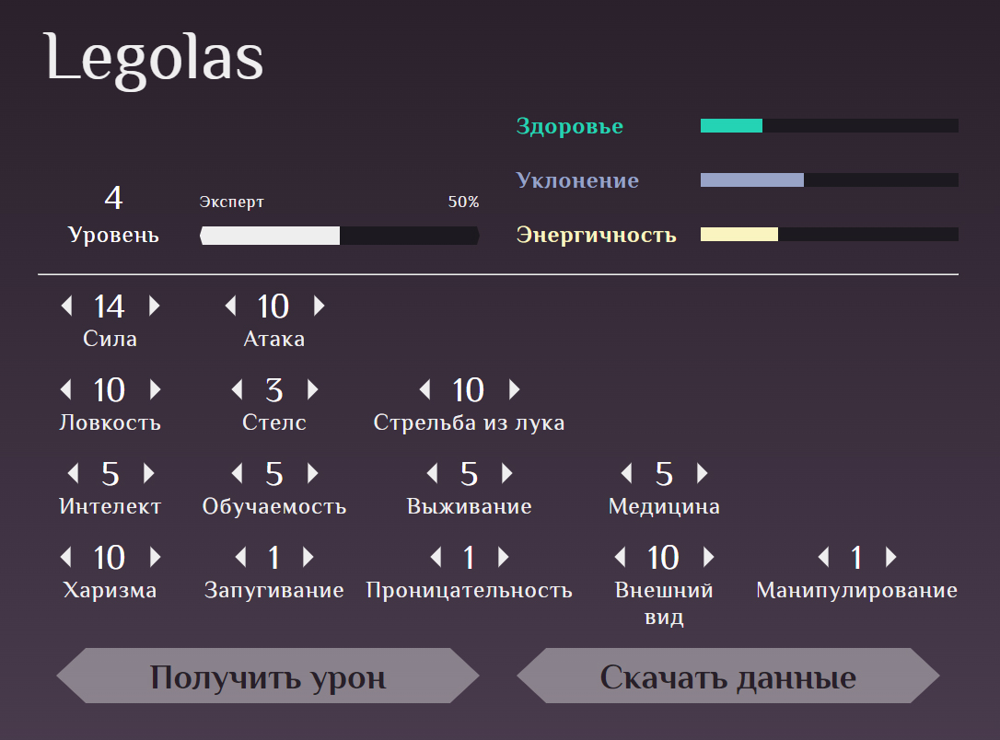

# Getting Started with Create React App

This project was bootstrapped with [Create React App](https://github.com/facebook/create-react-app).

# Тестовое задание: меню RPG персонажа

[🎮Demo](http://bigfatpartyguy.github.io/rpg-character-menu) (not working correctly at the moment)

## Описание

Приложение позволяет редактировать характеристики персожана абстрактной RPG игры.
На начальном экране можно загрузить характеристики персонажа из файла в формате .json, либо создать нового персонажа.

На экране меню персонажа можно редактировать такие параметры персонажа, как имя, основные характеристики и второстепенные характеристики. При изменении основных и второстепенных характеристик изменяется уровень персонажа. При изменении основных характеристик изменяются базовые параметры персонажа, такие как здоровье, уклонение и энергичность.
Также на экране меню персонажа можно скачать параметры персонажа в формате .json, а также нанести персонажу урон. При нанесении урона у персонажа отнимается здоровье.

## Доступные скрипты

### `npm start`

Запускает приложение. 
Перейдите на [http://localhost:3000](http://localhost:3000) чтобы открыть приложение в браузере.
